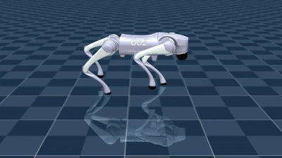

# STRIDE — Learning Quadruped Locomotion & Push Recovery from Scratch

> **Trained a 15 kg Unitree Go2 quadruped to locomote from scratch with deep reinforcement learning
> (PPO in MuJoCo), developing a single neural locomotion policy for gait generation and disturbance
> recovery. The policy recovers from impulsive, unanticipated mid-gait pushes across 8 directions —
> 100% recovery at 90 N (~0.6× body weight) on flat ground, and 100% / 91.7% recovery at 75 N / 90 N
> on procedurally generated uneven terrain (0.15 m elevation).**

STRIDE is a reinforcement-learning project that teaches a **Unitree Go2** quadruped to walk in
**MuJoCo**, trained **from scratch with PPO**. Over a sequence of numbered *Runs* it grew from a robot
that couldn't stand into a single feed-forward neural-network policy that trots, recovers from hard
shoves, and walks over uneven terrain — no hand-coded controller anywhere in the loop.

---

## Headline result

On the **15.21 kg** Unitree Go2 (149 N body weight), the shipped policy recovers from **impulsive,
unannounced** torso shoves applied mid-trot (0.2 s, 8 compass directions, 24 episodes):

| impulse (8 directions, impulsive mid-gait) | flat ground | uneven terrain (0.15 m) |
|---|---|---|
| **75 N** (≈ 0.50× body weight) | — | **100 % (24/24)** |
| **90 N** (≈ 0.60× body weight) | **100 % (24/24)** | **91.7 % (22/24)** |

The shoves are applied while the robot is trotting, with **no command and no warning**, so recovery is
purely *reactive* — the hardest and most honest robustness test. The only falls in the entire sweep are
sideways / back-left (90°, 135°) shoves on terrain at 90 N; lateral disturbance on uneven ground is the
single hard case, which is expected for a diagonal trot (narrow lateral support, legs cycle fore-aft).

Evidence: [`python/final/eval_3000000_steps.txt`](python/final/eval_3000000_steps.txt) (each result
tagged with its ground condition). Full protocol and failure-direction analysis: the **Final** entry of
[`report_logs_4.md`](report_logs_4.md).

**Demo** — the shipped policy trotting in MuJoCo:



---

## How it works (the four-phase journey)

The policy outputs joint targets at 50 Hz, the simulator rolls physics forward, and PPO rewards forward
progress + staying upright + a clean gait. It was built in four phases, each recorded in its own log:

1. **Flat walking, from scratch** — [`report_logs_1.md`](report_logs_1.md) (Runs 1–10). Reward-hacked
   standing → faceplant → PD position control → crouch → shuffle → a prescribed diagonal-trot schedule →
   a clean converged trot.
2. **Disturbance robustness (fixed-clock)** — [`report_logs_2.md`](report_logs_2.md) (Runs 11–15).
   Spawn-settle hold, push domain-randomization, and a **`d`-gated recovery mode** (an off-balance
   signal relaxes the tidy-gait penalties and lowers the height target so crouching / stepping-out
   become the *rewarded* response). Reached 100 % push recovery on flat ground.
3. **PMTG migration** — [`report_logs_3.md`](report_logs_3.md) (Runs 16–25). Replaced the fixed gait
   clock with a **policy-modulated phase + foot-trajectory generator** (ANYmal / Lee 2020, Iscen 2018),
   so the gait becomes a *breakable prior the policy controls* — the prerequisite for adapting footfalls
   to terrain. New 16-D action / 60-D obs space, trained from scratch.
4. **Push recovery + terrain on the new architecture** — [`report_logs_4.md`](report_logs_4.md)
   (Runs 26 → Final). Re-won push recovery (Run 26, 100 %), built the `d`-gated *structure* release for
   terrain (Run 27), then solved terrain with **box-tile terrain** after MuJoCo's heightfield collider
   proved unusable for a small foot → the shipped `final/` model.

---

## The final controller (architecture)

- **Control:** PD **position** control at 50 Hz (`frame_skip=10`, 0.002 s timestep, `KP=30, KD=0.75`).
  The policy outputs *offsets*; the PD law makes torque, so the robot holds itself up "for free."
- **PMTG / FTG:** one shared trot clock (`BASE_FREQ=1.5 Hz`) + fixed trot offsets `[0,0.5,0.5,0]` + a
  per-leg phase offset the policy drives (clamped to ±`DELTA_MAX`). A **Foot Trajectory Generator** adds
  the nominal swing arc; the policy adds **residuals** on top. Coordination and swing are *structural*,
  not emergent from reward — the hard lesson of Runs 16–25.
- **Action (16-D):** 12 joint residuals + 4 per-leg frequency offsets. **Obs (60-D):** local-ground
  height, orientation, joint angles/velocities, base lin/ang velocity, commanded speed, previous action,
  and the 4 per-leg phase `sin/cos`. VecNormalize on observations and reward.
- **`d`-gated recovery + released structure:** an off-balance signal `d` relaxes the pose / abduction /
  phase / tracking rewards and lowers the height target; under disturbance it **also fades the FTG swing
  arc and widens the phase clamp**, so a leg can break the fixed swing and retime to brace or step over a
  bump. When calm (`d=0`) the clean trot is untouched.
- **Foot:** a **0.035 m capsule** (the menagerie's 0.022 m sphere extended up the shank, radius bumped)
  so it lands on the box-tile tops and bridges inter-tile steps.
- **Terrain:** a forward strip of overlapping **box tiles as mocap bodies** (per-episode heights set via
  `data.mocap_pos`, so collision tracks them — a moving *static* geom would not), with **fractal
  multi-octave value-noise heights** and a flat spawn patch. (MuJoCo's heightfield collider was
  abandoned as unstable for a small foot; see MuJoCo discussions #2175 / #2307 and the Final log entry.)
- **PPO:** `MlpPolicy [256,256]`, 8 envs, `n_steps=2048`, `batch=4096`, `n_epochs=10`, `γ=0.99`,
  `gae_λ=0.95`, `lr=3e-4`, `clip=0.2`, 3 M steps. Warm-starts raise `ent_coef→0.01` and reset the action
  `std→0.5` for exploration.

---

## Setup

- **OS:** Windows (native, no WSL). **Python:** 3.12 (Python 3.14 has no MuJoCo / SB3 wheels).
- **Key packages:** `mujoco` 3.9, `gymnasium` 1.3, `stable-baselines3` 2.8, `tensorboard`, PyTorch.
  Do **not** install the legacy `gym` package — it breaks the install.

```bat
cd E:\STRIDE
py -3.12 -m venv py12venv
py12venv\Scripts\Activate.ps1
python -m pip install --upgrade pip
pip install mujoco "gymnasium[mujoco]" "stable-baselines3>=2.3.0" tensorboard
```

The robot model lives in `mujoco_menagerie/unitree_go2/`. If you cloned this repo without it, fetch
DeepMind's [mujoco_menagerie](https://github.com/google-deepmind/mujoco_menagerie) and copy the
`unitree_go2/` folder in (this repo vendors the modified `go2.xml` with the 0.035 m capsule foot and the
generated `scene_terrain.xml`). Always activate the venv before running anything.

---

## How to run

From `E:\STRIDE\python` with the venv active.

```bat
:: Train (flat / push / terrain). Warm-start is set by WARM_START at the top of train.py.
python train.py
python train.py --push
python train.py --terrain --terrain-height 0.15

:: Watch a checkpoint (arg 1-4 = 750k/1.5M/2.25M/3M, 0 = latest). --dir picks the folder.
python watch.py 4 --dir final
python watch.py 4 --dir final --terrain

:: Quantitative push-recovery eval (writes eval_<N>_steps.txt, tagged [flat ground] / [terrain H]).
python eval_policy.py 4 --dir final                          :: flat
python eval_policy.py 4 --dir final --terrain --terrain-height 0.15
python eval_policy.py 4 --dir final --terrain --force 0      :: no-shove terrain-traversal survival

:: Terrain tooling
python make_box_terrain.py        :: regenerate scene_terrain.xml (edit XB/XF/YH/PITCH/HALF in-file)
python terrain_preview.py 0.15    :: preview elevation / slope / step difficulty for a given height

:: TensorBoard
tensorboard --logdir runs
```

Terrain tuning lives in `train.py`: `TERRAIN_XB/XF/YH/PITCH` (strip extent — must match
`make_box_terrain.py`) and `TERRAIN_OCTAVES` (fractal `(period_m, amplitude)` layers; smaller period =
rougher). Preview any change with `terrain_preview.py` before training.

**Checkpoint hygiene:** `train.py` wipes `python/checkpoints/` at the start of every run — rename a
run's output to a descriptive folder before launching the next.

---

## Repository layout

```
STRIDE/
├── README.md                   <- this file
├── report_logs_1.md            <- Runs 1–10  : flat walking from scratch (+ base setup reference)
├── report_logs_2.md            <- Runs 11–15 : terrain (early) + fixed-clock push recovery
├── report_logs_3.md            <- Runs 16–25 : the PMTG / FTG migration
├── report_logs_4.md            <- Runs 26 → Final : Tier-3 push recovery + box-tile terrain (SHIPPED)
├── vid/walk.gif                <- demo clip of the shipped policy
├── mujoco_menagerie/unitree_go2/
│   ├── go2.xml                 <- robot (CAPSULE foot 0.035, elliptic-cone contact)
│   ├── scene.xml               <- Go2 + flat floor (flat training / eval)
│   └── scene_terrain.xml       <- Go2 + BOX-TILE terrain (generated by make_box_terrain.py)
└── python/
    ├── train.py                <- MAIN: Tier-3 PMTG/FTG env + reward + PPO (--push, --terrain)
    ├── watch.py                <- MuJoCo viewer (--terrain, --push supported)
    ├── eval_policy.py          <- quantitative push-recovery eval (--terrain, --terrain-height, --force)
    ├── make_box_terrain.py     <- generates scene_terrain.xml (box-tile forward strip)
    ├── terrain_preview.py      <- previews terrain difficulty (elevation / slope / steps) without training
    ├── final/                  <- ★ SHIPPED policy (3 M) — the deliverable (PPO + VecNormalize + evals)
    └── legacy/
        ├── legacy_12D_output/  <- fixed-clock era: run8_gait, run14_push, run15_recovery (+ legacy scripts)
        └── legacy_16D_output/  <- Tier-3 milestones: run25_ftg (clean flat trot), run26/27_push_ftg
```

---

## Research logs (in-depth)

The four logs share one per-run format — metadata → what changed from the previous run → problem
analysis with real numbers → the next proposed change. Read them in order for the full story:

- [`report_logs_1.md`](report_logs_1.md) — flat walking from scratch (opens with the full base setup).
- [`report_logs_2.md`](report_logs_2.md) — fixed-clock push recovery to 100 % on flat.
- [`report_logs_3.md`](report_logs_3.md) — the PMTG / FTG architecture migration.
- [`report_logs_4.md`](report_logs_4.md) — **Tier-3 push recovery + box-tile terrain → the shipped
  model.** The **Final** entry is the capstone (results, résumé line, and why terrain was warm-started
  from the `d`-gated Run 27). Start here for the headline result.

---

## What's next (for v2 maybe)

- **Goal-directed locomotion:** The obs already carries a *commanded forward speed*. Generalize it to a
  **commanded direction** (a velocity vector or heading), feed the goal-relative direction, and the same
  policy steers toward a goal. Since that changes the obs shape, don't retrain from scratch — do **weight
  surgery** (copy existing weights into the larger network, zero-init the new input columns) and
  fine-tune; locomotion transfers, only steering is learned.
- **Integration with Robot Perception:** Extend the policy beyond proprioceptive control by incorporating exteroceptive observations (depth cameras / LiDAR / terrain maps), enabling the quadruped to perceive obstacles, terrain variations, and foothold availability for navigation in unknown environments.
